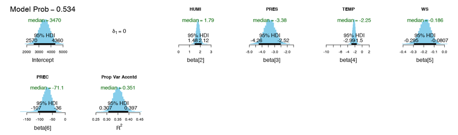
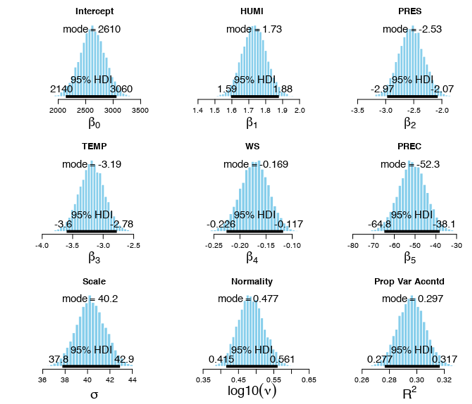
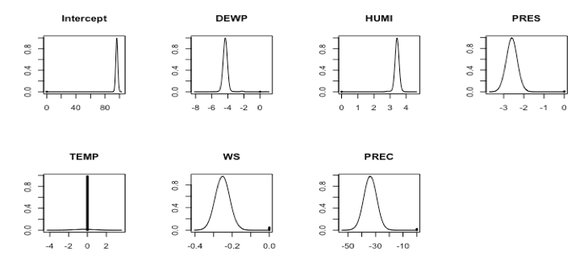
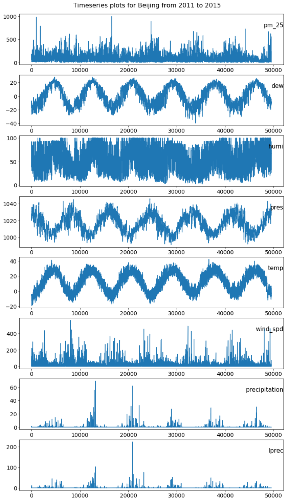
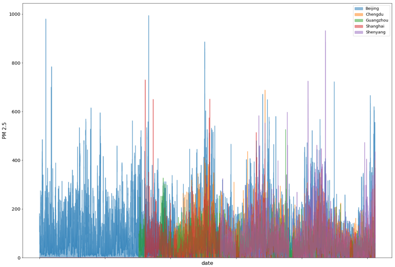
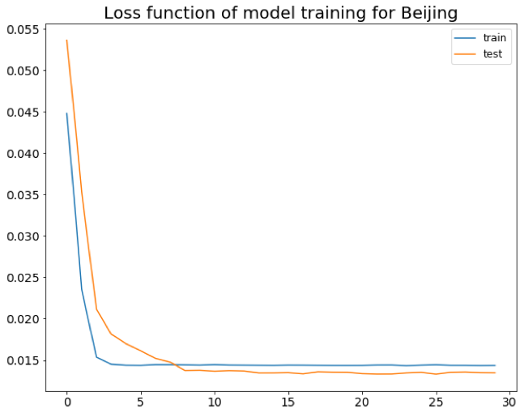
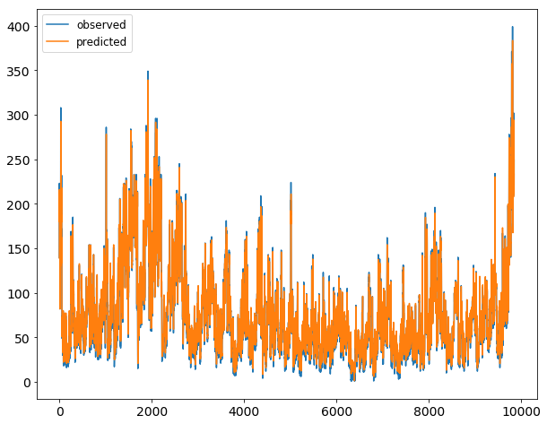

# Capstone-2019Spring
This is my Data Science Capstone Project. This project aims to predict PM2.5 using two different approaches: Bayesian Hierarchical Model and LSTM network.  
## Dataset
The dataset is downloaded from UCI Machine Learning Repository (http://archive.ics.uci.edu/ml/datasets/PM2.5+Data+of+Five+Chinese+Cities). 
## Dataset Processing
The data processing for Bayesian model is in EDA.R in Bayesian_Model directory.
The data processing for LSTM model is in preprocess.ipynb, processed files are saved in processedData directory.
## Bayesian Hierachical Model
The results are generated in Bayesian_Model.R, include variable selection, bayesian linear regression, and bayesian model averaging.

Variable selection --model with highest probablity

Bayesian linear model  

Bayesian model averaging

## LSTM Model
The results are generated in LSTM_model.ipynb, include timeseries plots, loss function history, and model prediction.

Timeseries plots of PM2.5 and predictors

Timeseries plots of Pm2.5 in five cities

LSTM network training --loss function

Model prediction -- e.g. Chengdu  

